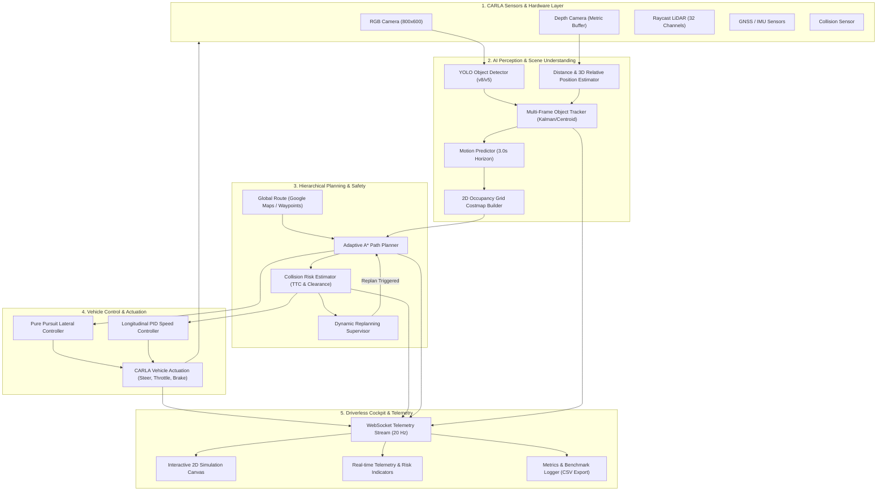

# System Architecture

## Autonomous Vehicle Simulation Platform
**Adaptive Path Planning and Collision Avoidance for Autonomous Vehicles on Unstructured Indian Roads**

---

## 1. Top-Level System Dataflow

---

## 2. Component Pipeline Breakdown

### 2.1 Sensor Layer
- **RGB Camera**: Captures high-resolution front-facing road views at 20 frames per second.
- **Depth Camera**: Encodes 24-bit normalized distance depth map for sub-centimeter geometric ranging.
- **GNSS/IMU**: Provides global coordinates, orientation, velocity, and linear acceleration.
- **Collision Detector**: Registers physical contact impulses with actors in the simulator.

### 2.2 Perception Layer
- **YOLO Detection Engine**: Evaluates bounding boxes for heterogeneous Indian road objects: Pedestrians, Bicycles, Motorcycles/Scooters, Cars, Auto-Rickshaws, Buses, Trucks, Stray Cattle/Animals, and Static Road Debris.
- **Distance Estimator**: Fuses depth sensor raycasting with pinhole perspective geometry:
  $$Z = \frac{f_y \cdot H_{\text{real}}}{h_{\text{pixels}}}$$
- **Multi-Frame Object Tracker**: Tracks object identities across time steps, computing instantaneous velocity vectors $(v_x, v_y)$ and heading angles $\theta$.
- **Occupancy Costmap Generator**: Generates 2D discrete grid ($0.5\text{m}$ resolution) combining road boundary constraints and inflated obstacle threat bubbles.

### 2.3 Planning & Collision Avoidance Layer
- **Adaptive A\* Planner**: Multi-objective search minimizing travel distance, obstacle proximity risk, and path curvature.
- **Risk Estimator (TTC)**: Deterministic Time-To-Collision monitoring:
  $$\text{TTC} = \frac{d_x}{v_{\text{ego}} - v_{\text{obs},x}}$$
  Classifies operational safety into **LOW**, **MEDIUM**, **HIGH**, **CRITICAL**.
- **Dynamic Replanner**: Detects path intrusions and generates evasive trajectories in $< 10\text{ ms}$.

### 2.4 Control & Actuation Layer
- **Pure Pursuit Controller**: Lateral steering regulation based on vehicle wheelbase and target lookahead curvature:
  $$\kappa = \frac{2 \cdot y_t}{L_d^2}, \quad \delta = \arctan(\kappa \cdot L)$$
- **Longitudinal PID**: Controls throttle and braking to regulate velocity according to safety supervisor demands.

### 2.5 Real-Time Telemetry & Cockpit
- **WebSocket Gateway**: High-performance asynchronous streaming at 20 Hz.
- **Interactive Canvas**: Renders ego vehicle, surrounding actors, sensor footprints, global route, adaptive A* path, and predicted trajectory cones.
